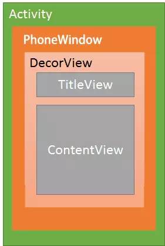
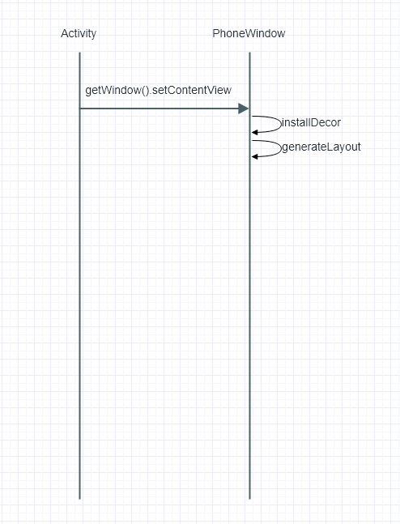

**介绍Activity.setContentView()源码流程**

Activity、PhoneWindow、DecorView的关系如下图

说明：

每一个Activity都包含一个Window对象，Window对象通常由PhoneWindow实现

DecorView：顶层视图，将要显示的具体内容呈现在PhoneWindow上.DecorView布局只有一个子元素为LinearLayout。代表整个Window界面，包含通知栏，标题栏，内容显示栏三块区域

先看下图整体流程：

1、调用activity.setContentView时
    
     public void setContentView(@LayoutRes int layoutResID) {
        getWindow().setContentView(layoutResID);
        initWindowDecorActionBar();
     }
     
调用的Window.setContentView，实际是调用的是PhoneWindow.setContentView

     @Override
    public void setContentView(int layoutResID) {
        // Note: FEATURE_CONTENT_TRANSITIONS may be set in the process of installing the window
        // decor, when theme attributes and the like are crystalized. Do not check the feature
        // before this happens.
        if (mContentParent == null) {
            //创建DecorView，并添加到mContentParent上
            installDecor();
            //FEATURE_CONTENT_TRANSITIONS标记当前内容加载有没有使用过度动画，也就是转场动画
        } else if (!hasFeature(FEATURE_CONTENT_TRANSITIONS)) {
            mContentParent.removeAllViews();
        }

        if (hasFeature(FEATURE_CONTENT_TRANSITIONS)) {
            final Scene newScene = Scene.getSceneForLayout(mContentParent, layoutResID,
                    getContext());
            transitionTo(newScene);
        } else {
            //将要加载的资源添加到mContentParent上
            mLayoutInflater.inflate(layoutResID, mContentParent);
        }
        mContentParent.requestApplyInsets();
        final Callback cb = getCallback();
        if (cb != null && !isDestroyed()) {
            //回调通知表示完成界面加载
            cb.onContentChanged();
        }
    }

如果当前内容还未放置到窗口，此时mContentParent==null，是第一次启动则会调用到installDecor

    private void installDecor() {
        if (mDecor == null) {
        //调用该方法创建new一个DecorView
            mDecor = generateDecor();
            mDecor.setDescendantFocusability(ViewGroup.FOCUS_AFTER_DESCENDANTS);
            mDecor.setIsRootNamespace(true);
            if (!mInvalidatePanelMenuPosted && mInvalidatePanelMenuFeatures != 0) {
                mDecor.postOnAnimation(mInvalidatePanelMenuRunnable);
            }
        }
        //一开始DecorView未加载到mContentParent，所以此时mContentParent=null
        if (mContentParent == null) {
        //该方法将mDecorView添加到Window上绑定布局
            mContentParent = generateLayout(mDecor);

            // Set up decor part of UI to ignore fitsSystemWindows if appropriate.
            mDecor.makeOptionalFitsSystemWindows();

            final DecorContentParent decorContentParent = (DecorContentParent) mDecor.findViewById(
                    R.id.decor_content_parent);
                
                ...//添加其他资源
                ...//设置转场动画
        }
    }
    
可以看到该方法，先通过调用generateDecor创建DecorView

    protected DecorView generateDecor() {
        return new DecorView(getContext(), -1);
    }
    
创建完后再通过调用generateLayout将setContentView的内容赋值到mContentParent

     protected ViewGroup generateLayout(DecorView decor) {
        // Apply data from current theme.
        //根据当前设置的主题来加载默认布局
        TypedArray a = getWindowStyle();
        //如果你在theme中设置了window_windowNoTitle，则这里会调用到，其他方法同理，
        //这里是根据你在theme中的设置去设置的
        if (a.getBoolean(R.styleable.Window_windowNoTitle, false)) {
            requestFeature(FEATURE_NO_TITLE);
        } else if (a.getBoolean(R.styleable.Window_windowActionBar, false)) {
            // Don't allow an action bar if there is no title.
            requestFeature(FEATURE_ACTION_BAR);
        }
        //是否有设置全屏
        if (a.getBoolean(R.styleable.Window_windowFullscreen, false)) {
            setFlags(FLAG_FULLSCREEN, FLAG_FULLSCREEN & (~getForcedWindowFlags()));
        }
        
        ...//省略其他加载资源
        
        // 添加布局到DecorView，前面说到，DecorView是继承与FrameLayout，它本身也是一个ViewGroup，而我们前面创建它的时候，只是调用了new DecorView，此时里面并无什么东西。而下面的步奏则是根据用户设置的Feature来创建相应的默认布局主题。举个例子，如果我在setContentView之前调用了requestWindowFeature(Window.FEATURE_NO_TITLE)，这里则会通过getLocalFeatures来获取你设置的feature，进而选择加载对应的布局，此时则是加载没有标题栏的主题，对应的就是R.layout.screen_simple

        int layoutResource;
        int features = getLocalFeatures();
        // System.out.println("Features: 0x" + Integer.toHexString(features));
        if ((features & (1 << FEATURE_SWIPE_TO_DISMISS)) != 0) {
            layoutResource = R.layout.screen_swipe_dismiss;
        } ... //省略其他判断方法
        } else {
            // Embedded, so no decoration is needed.
            layoutResource = R.layout.screen_simple;
            // System.out.println("Simple!");
        }

        mDecor.startChanging();
        //选择对应布局创建添加到DecorView中
        View in = mLayoutInflater.inflate(layoutResource, null);
        decor.addView(in, new ViewGroup.LayoutParams(MATCH_PARENT, MATCH_PARENT));
        mContentRoot = (ViewGroup) in;
        ViewGroup contentParent = (ViewGroup)findViewById(ID_ANDROID_CONTENT);
        ...
        return contentParent;
    }
    
首先generateLayout会根据当前用户设置的主题去设置对应的Feature，接着，根据对应的Feature来选择加载对应的布局文件
，**这也就是为什么我们要在setContentView之前调用requesetFeature的原因。**

最终创建完DecorView并且获取到mContentParent，接着就是将你setContentView的内容添加到mContentParent中，最后调用Callback来通知界面发生改变，
也就是Activity.onContentChanged