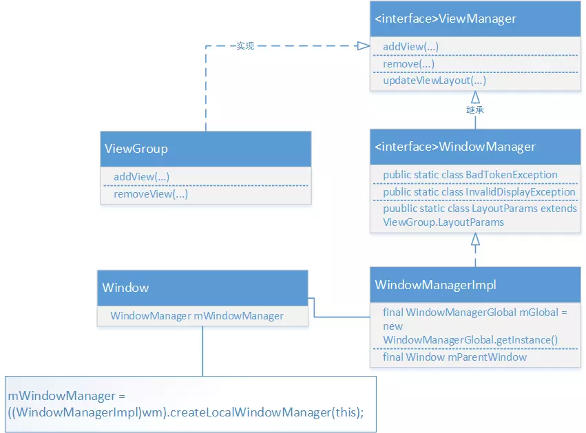

**窗口机制**

先了解一个图的关系 

Instrumentation：负责发起Activity的启动、并具体负责Activity的创建以及Activity生命周期的回调。一个应用进程只会有一个Instrumentation对象，App内的所有Activity都持有该对象的引用。

Window的创建以及WindowManger的绑定在启动Activity的过程中就绑定了

代码流程：

